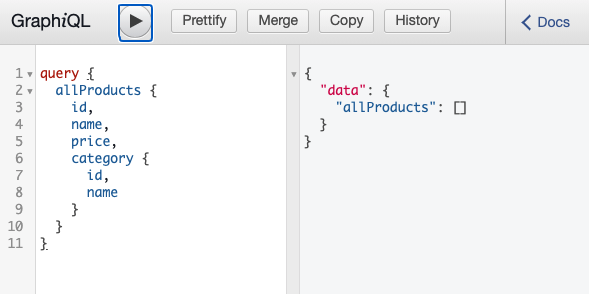

# Django & SwiftUI GraphQL

Server - python Django

Client - SwiftUI (iOS)


## Steps

- Django

```
1. Open django/app with IDE
2. On the terminal, input that commands

$ python3 -m venv venv
$ source venv/bin/activate
$ pip install django
$ pip install graphene_django
$ python manage.py migrate
$ python manage.py createsuperuser
$ python manage.py runserver
```

You can see this http://localhost:8000/graphql/



If you want to create Product or Category, you can make that with your superuser account at http://localhost:8000/admin/


## References

graphQL vs REST API - https://www.apollographql.com/blog/graphql-vs-rest-5d425123e34b/

- django

graphQL Read - https://medium.com/@alhajee2009/graphql-with-django-a-tutorial-that-works-2812be163a26

graphQL CRUD - https://medium.com/analytics-vidhya/graphql-with-django-simple-yet-powerful-crud-part-2-bacce3668e35

- swiftUI

Library - [Graphaello](https://github.com/nerdsupremacist/Graphaello)

When I followed the official document, it was a bit tricky because it was different and there wasn't a lot of data. It was convenient to generate automatically related to Apollo, but there were many cases where I had to open the library source.
